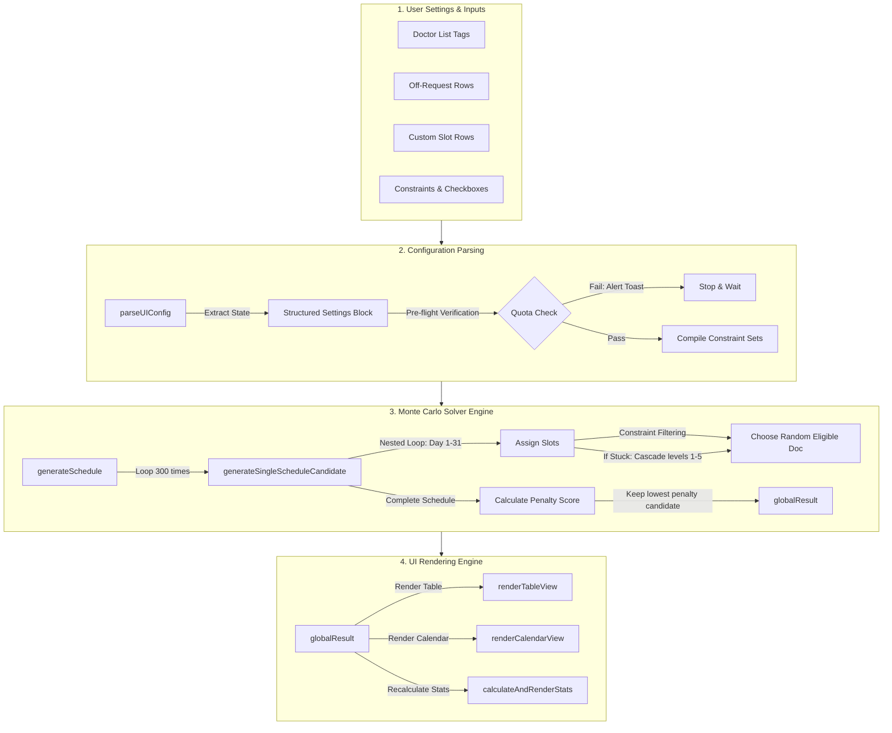
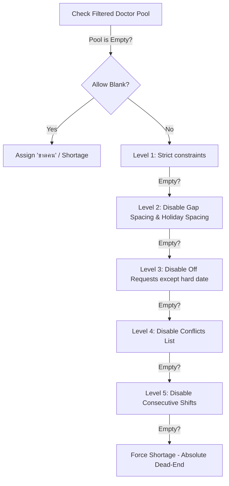

# 🩺 Deep-Dive Technical Reference & Logic Report

This document is a comprehensive, unrestricted guide to the codebase of the **Automatic On-Call & Night Shift Doctor Scheduler**. It details the mathematical formulas, algorithm steps, state management lifecycle, function APIs, security measures, and responsive designs used in the system.

---

## 🗺️ System Architecture & Data Flow

The application runs entirely on the client side inside the browser sandbox. It utilizes an event-driven flow where state mutations in configuration instantly trigger recalculations of the schedule candidate pool.



---

## 💾 Core State Management

The application's runtime memory is managed by several global variables declared at the top of `app.js`. Understanding these is critical to modifying behavior:

*   `doctors` (Array of Strings): The list of doctor names. Example: `["A", "B", "C"]`.
*   `offData` (Array of Objects): Stores requests for days off.
    *   *Schema*: `{ id: Number, date: String, names: String }` (where names is a comma-separated list).
*   `extraSlotsData` (Array of Objects): Custom shifts needed on specific calendar days.
    *   *Schema*: `{ id: Number, date: String, count: Number, slotsPerRole: Object }`.
*   `manualOverrides` (Object): Stores manual doctor swaps made directly by clicking cells.
    *   *Structure*: `{ [dayNumber]: { [slotIndex]: "Doctor Name" } }`.
*   `globalResult` (Object): The winning schedule generated by the solver.
    *   *Structure*:
        ```json
        {
          "schedule": [
            {
              "day": 1,
              "dayName": "Monday",
              "selectedDocs": [{ "name": "A", "role": "R1" }, { "name": "B", "role": "R2" }],
              "note": "Weekend / Holiday"
            }
          ],
          "month": 10,
          "year": 2026,
          "maxSlots": 3,
          "score": 150.45
        }
        ```
*   `currentLang` (String): Tracks active language. Values: `"th"` or `"en"`.

---

## 🧠 Detailed Breakdown of the Monte Carlo Solver

The core scheduling problem is NP-hard, meaning the number of possible schedule combinations grows exponentially with the number of doctors, roles, days, and constraints. An analytical approach often gets stuck. The solver instead uses a **Monte Carlo approach** with random greedy selection.

### 1. The Parser: `parseUIConfig()`
Before any scheduling runs, this function translates human input fields from the webpage into structured collections for the algorithm. It processes:
1.  **Doctor-to-Role Mapping**: Converts text like `A:R1, B:R2` into a fast key-value map: `{ "A": "R1", "B": "R2" }`.
2.  **Special Holidays**: Parses comma-separated holiday strings into a `Set` for $O(1)$ lookup speeds.
3.  **No-Duty Days**: Converts days with no active shifts into another lookup `Set`.
4.  **Role Quotas**: Parses exact monthly limits like `R1:12, R2:10` into a dictionary: `{ "R1": 12, "R2": 10 }`.
5.  **Conflict Lists**: Parses items like `A:B` into bidirectional sets: `{ "A": Set("B"), "B": Set("A") }`.
6.  **Locked Special Rules**: Extracts locked doctor arrays for specific early days of the month.
7.  **Custom Date Range Logic**: If `isCustomDateRange` is active, computes an exact timeline array (`scheduleDates`) of `Date` objects from the start to end date (up to 90 days), and normalizes the `totalDaysInMonth` loop boundary.

### 2. Pre-flight Quota Calculation
If **Role-Based Mode** is active, the algorithm runs a check:
$$\sum \text{Quotas} = \text{Total Shifts for the Month}$$
If the total shifts required for the month (considering custom slots and weekend configurations) does not match the sum of exact doctor quotas, the solver aborts and prompts:
*   *Thai*: `"ข้อผิดพลาด: โควตาเวรทั้งหมด (X) ต้องเท่ากับจำนวนเวรทั้งหมดในเดือน (Y)"`
*   *English*: `"Error: Total doctor shift quotas (X) must equal total shifts required (Y)"`

**Exception**: If **Allow Blank Days** (`chkAllowBlankDays`) is checked, this pre-flight validation is bypassed to allow the solver to run and output blank slots (`ขาดคน`) for unbalanced configurations.

---

### 3. Loop Iterations: `generateSingleScheduleCandidate(config)`

This function runs inside a loop (300 iterations). It attempts to assign doctors for each day.

```text
FOR day = 1 TO totalDaysInMonth:
    1. Resolve real calendar date (`Date` object via Month/Year or `scheduleDates` array if custom range).
    2. Read slot configuration for this day (defaults or custom override).
    3. Determine if it is a holiday/weekend using the resolved `Date`.
    4. Loop through each slot index:
        a. Apply Filter Rules to eliminate ineligible doctors.
        b. If no doctors remain, trigger the Must-Fill Cascade.
        c. Randomly select one doctor from the remaining pool.
        d. Assign the doctor to the slot.
        e. Update the doctor's shift count: tCounts[doc]++.
```

#### A. Filter Rules & Constraints
During standard selection (Cascade Level 1), the solver filters out doctors using these tests:
1.  **Hard Quota Cap**: If `tCounts[doc] >= quota`, the doctor is excluded.
2.  **Role Isolation**: If the slot is designated for role `R2`, only doctors mapped to `R2` are allowed.
3.  **Double Shift Rule**: A doctor already assigned to a slot on `day` cannot be assigned to another slot on the same `day`.
4.  **Off Requests**: Excludes doctors who requested `day` off, or requested `day + 1` off (to prevent working a night shift right before a rest day).
5.  **Consecutive Shifts**: Excludes a doctor if they worked on `day - 1`.
6.  **Holiday Spacing**: If `day` is a holiday/weekend, excludes doctors who worked on the previous holiday/weekend.
7.  **Gap Spacing**: If possible, excludes doctors who worked on `day - 2` to maintain a 2-day recovery gap.
8.  **Conflict List**: Excludes doctor `A` if doctor `B` is already scheduled on the same day and `A` is in `B`'s conflict list.

#### B. The Must-Fill Cascade (Fallback Levels)
If all doctors are filtered out and the slot is empty:
*   **If "Allow Blank Days" is ON**: The slot is left as `SHORTAGE_MARKER` (`ขาดคน`), and the solver continues.
*   **If "Allow Blank Days" is OFF**: The solver progressively disables constraints in a 5-step fallback to avoid a blank slot:



*   **Level 1**: Strict constraints.
*   **Level 2**: Ignores 2-day gap rules and consecutive weekend/holiday rules.
*   **Level 3**: Ignores the day-before-off request rule (still respects the actual day off).
*   **Level 4**: Ignores the conflicts list.
*   **Level 5**: Ignores the consecutive shift rule.
*   **Absolute Safeguards (Never Disabled)**:
    1.  **Hard Quotas**: A doctor who hit their limit is never picked.
    2.  **Role Isolation**: An `R1` slot will never receive an `R2` doctor.
    3.  **Uniqueness**: A doctor will never work two slots on the same day.

---

### 4. Schedule Evaluation: Scoring & Penalty Math

Once a candidate schedule is built, the solver evaluates its quality by calculating a **Penalty Score**. 

$$Score = (S \times 100000) + (C \times 1000) + (G \times 100) + (\sigma \times 50)$$

Where:
*   **$S$ (Shortages)**: Number of unfilled slots (`ขาดคน`).
*   **$C$ (Consecutive Violations)**: Number of instances where a doctor works two consecutive days.
*   **$G$ (Gap Spacing Violations)**: Number of instances where a doctor has less than 2 days of rest between shifts.
*   **$\sigma$ (Workload Variance)**: The Standard Deviation of shifts allocated to the active doctor pool.

#### Workload Variance Standard Deviation Formula:
$$\sigma = \sqrt{\frac{1}{N}\sum_{i=1}^{N}(X_i - \mu)^2}$$
Where:
*   $N$ is the number of active doctors.
*   $X_i$ is the number of shifts assigned to doctor $i$.
*   $\mu$ is the mean shift count ($\text{Total Shifts} / N$).

A schedule with a **lower penalty score** is more balanced and contains fewer rule violations. The solver tracks the candidate with the lowest score across all 300 runs.

---

## 💻 Detailed Function Reference

Here is a detailed breakdown of the functions in `app.js`:

### 🧬 Core Algorithmic Functions

#### `generateSchedule()`
*   **Type**: Asynchronous (via batch execution).
*   **Responsibility**: The entry point for schedule calculation. It displays a loading animation, parses inputs, triggers the Monte Carlo solver, finds the lowest penalty schedule, updates the global state `globalResult`, and renders the UI.
*   **Code Design**:
    ```javascript
    window.generateSchedule = function () {
        // ... (UI state validation)
        let iterations = 300;
        let bestCandidate = null;
        
        function runBatch(startIndex) {
            let batchSize = 50;
            for (let i = 0; i < batchSize; i++) {
                let candidate = generateSingleScheduleCandidate(config);
                if (candidate && (!bestCandidate || candidate.score < bestCandidate.score)) {
                    bestCandidate = candidate;
                }
            }
            if (startIndex + batchSize < iterations) {
                // Yield thread to keep UI responsive
                setTimeout(() => runBatch(startIndex + batchSize), 0);
            } else {
                // Done! Update UI
                globalResult = bestCandidate;
                renderTableView();
                renderCalendarView();
                calculateAndRenderStats();
            }
        }
        runBatch(0);
    };
    ```

#### `generateSingleScheduleCandidate(config)`
*   **Inputs**: `config` (object containing parsed constraints).
*   **Outputs**: A schedule candidate object, or `null` if pre-flight validation fails.
*   **Responsibility**: Builds a single schedule candidate. Contains the nested loops (days, slots) and applies the constraint validation logic and fallback cascades.

---

### 🎨 Rendering & DOM Generation

#### `renderTableView()` & `renderCalendarView()`
*   **Type**: DOM Manipulation.
*   **Responsibility**: Converts the `globalResult.schedule` data array into HTML grids and tables.
*   **Security Feature**: Before injecting doctor names into templates, they are passed through the `esc()` sanitizer.
*   **Responsive Selector Binding**: Injects `<button onclick="openCellDropdown(event, 'id')">` into each slot.

#### `getCellDropdownOptionsHtml(day, slotIndex, currentDoc, config, isMobile)`
*   **Inputs**:
    *   `day` (Number): The calendar day.
    *   `slotIndex` (Number): The duty index on that day.
    *   `currentDoc` (String): The doctor currently occupying the slot.
    *   `config` (Object): Parsed configuration.
    *   `isMobile` (Boolean): If true, renders touch-friendly (48px+) buttons.
*   **Outputs**: HTML string representing the list of buttons.

---

### 🔧 Event & State Mutator Handlers

#### `updateDoctorAssignment(day, slotIndex, doctorIndex)`
*   **Inputs**:
    *   `day`: The day number.
    *   `slotIndex`: The slot index.
    *   `doctorIndex`: The index of the selected doctor in the global `doctors` array.
        *   `-1` maps to `SHORTAGE_MARKER` (`ขาดคน`).
        *   `-2` maps to empty (`-`).
*   **Responsibility**: Registers manual changes. It updates `manualOverrides`, updates the clicked cell in the DOM immediately, and schedules stats updates.

#### `resetSlotToAuto(day, slotIndex)`
*   **Responsibility**: Clears a manual override. Deletes the key from `manualOverrides[day][slotIndex]`, updates the cell's UI immediately, and triggers the solver to recalculate the slot.

---

### 📁 Config Persistence & Serialization

#### `exportConfigJSON()`
*   **Responsibility**: Serializes the application's configuration state.
*   **Format**: Creates a JSON string with the following schema:
    ```json
    {
      "doctors": ["Dr. A", "Dr. B"],
      "offData": [{"id": 1, "date": "5", "names": "Dr. A"}],
      "extraSlotsData": [],
      "manualOverrides": { "12": { "0": "Dr. B" } },
      "inputs": {
        "inputMonth": "10",
        "inputYear": "2026",
        "inputDefaultSlots": "2",
        "inputSpecialHols": "23",
        "inputNoDuty": "",
        "inputDoctorRoles": "Dr. A:R1, Dr. B:R2",
        "inputDefaultRoleSlots": "R1:1, R2:1",
        "inputRoleQuotas": "R1:12, R2:10",
        "inputConflicts": "",
        "inputSpecialDays": "1",
        "inputSpecialDocs": "Dr. A"
      },
      "checkboxes": {
        "chkRoleBased": true,
        "chkPreventConsecutive": true,
        "chkPreventLongGaps": false,
        "chkBalanceShifts": true,
        "chkAllowBlankDays": false,
        "chkUseSpecialRule": false
      }
    }
    ```

#### `importConfigJSON(event)`
*   **Responsibility**: Processes an imported JSON file.
*   **Validation**: Verifies that the JSON contains valid arrays for `doctors`, `offData`, and `extraSlotsData` to prevent crashes.
*   **Syncing**: Restores variables, fills in input fields and checkboxes, triggers layout redrawing, and runs the solver.

---

## 📝 Manual Override Pipeline & State Tracking

The application permits administrators to manually correct the generated schedule by mapping doctor index targets in `manualOverrides[day][slotIndex]`. 

### 1. Drag-and-Drop Cell Swap
Instead of relying purely on dropdowns, the layout leverages HTML5 DataTransfer events (`ondragstart`, `ondragover`, `ondrop`). 
- When dropped onto a new cell, the system intercepts the coordinate payload and executes two parallel `updateDoctorAssignment()` calls natively.
- This creates a fluid two-way index swap between arrays while completely bypassing the UI dropdown render loop.

### 2. History State Stack (Undo)
Because clicking and dragging can occasionally result in accidental mistakes, the engine wraps manual mutations inside a tracker:
- Before any change to `manualOverrides` (e.g. `updateDoctorAssignment`, `resetSlotToAuto`), `pushToUndoStack()` executes.
- `pushToUndoStack()` deeply clones (`JSON.parse(JSON.stringify(...))`) the current state tree into an array capped at a depth of 20.
- When `undoLastAction()` fires via `Ctrl+Z`, the engine pops the tail state, overwrites the active reference, and instantly repaints the dependent UI elements (`renderTableView`, `recalculateCounts`).

---

## 📱 Mobile Layout Responsive Mechanics

To provide a smooth experience on mobile devices, the interface adapts based on screen size:

1.  **Detection**: The click event is intercepted by `openCellDropdown()`.
2.  **Layout Selection**:
    *   **Desktop (`window.innerWidth >= 768px`)**: Toggles the `.hidden` class on the cell's absolute-positioned dropdown div.
    *   **Mobile (`window.innerWidth < 768px`)**: Ignores the cell's absolute container. Instead, it creates a global full-screen fixed overlay (`#mobileDoctorModal`).
3.  **Ergonomics**:
    *   The modal applies `fixed inset-0 bg-slate-900/40 backdrop-blur-sm` to dim out the background.
    *   The choices container slides up from the bottom using CSS transform translations (`translate-y-full` to `translate-y-0`) and transitions.
    *   Each choice button has a height of $\ge 48\text{px}$ to meet mobile touch target standards.

---

## 🔒 Security Architectures

To secure the application against client-side exploits (like Cross-Site Scripting or HTML injection):

1.  **XSS Protection via HTML Escaping**:
    Dynamic templates in the calendar grid and schedule list use the `esc()` function:
    ```javascript
    function esc(unsafe) {
        if (!unsafe) return '';
        return unsafe
            .toString()
            .replace(/&/g, "&amp;")
            .replace(/</g, "&lt;")
            .replace(/>/g, "&gt;")
            .replace(/"/g, "&quot;")
            .replace(/'/g, "&#039;");
    }
    ```
2.  **Index-based DOM Event Handlers**:
    Instead of passing raw doctor name strings to event attributes:
    ```html
    <!-- Unsafe (breaks if name contains quotes, e.g. O'Connor) -->
    <button onclick="removeDoctor('O'Connor')">
    
    <!-- Safe (uses array indices) -->
    <button onclick="removeDoctorByIndex(4)">
    ```
    This approach avoids string escaping issues and code injection vulnerabilities.

---

## 📶 Offline PWA (Progressive Web App) Architecture

To support environments with spotty or nonexistent internet connections (such as deep hospital wards or emergency rooms), the application functions as a fully offline-capable Progressive Web App.

### 1. Web App Manifest (`manifest.json`)
Defines the metadata configuration for the PWA:
- **Standalone Display Mode**: Launches in a borderless app window, removing standard browser UI inputs (URL bar, navigation keys) to feel like a native application.
- **Theme and Branding**: Incorporates a clean teal design system color (`#0D9488`) matching the Tailwind CSS primary color palette.
- **Embedded SVG Icons**: Uses lightweight, standard-compliant inline vector graphics to represent the scheduling app icon on device home screens, saving bandwidth.

### 2. Cache-First Service Worker (`sw.js`)
Handles offline asset delivery and state synchronization:
- **Pre-Caching Lifecycle**: During the `install` phase, download and cache core application assets:
  - Local documents: `./`, `./index.html`, `./app.js`, `./manifest.json`
  - External CDNs: Tailwind CSS, SheetJS (XLSX export), Lucide Icons, and Google Fonts (Sarabun).
- **Offline Fallback Route**: Listens to `fetch` events, attempting to retrieve resources directly from the local Cache storage first. If the cache misses, it falls back to the network.
- **Versioned Cache Invalidation**: Listens to the `activate` event, automatically wiping old versions of caches when updating CACHE_NAME to prevent serving stale client-side logic.

---

## 🧪 Solver Core Test Suite (`tests/solver.test.js`)

Because the scheduling engine is built with randomized Monte Carlo paths and dynamic cascade relaxations, boundary testing is critical to prevent silent calculation regressions. The project implements a lightweight Node.js test runner validating three corner-case scenarios:

### 1. Mocking DOM & Browser Sandboxing
Since `app.js` runs in the browser, the Node.js test harness mocks:
- `global.document` (mocking element retrievals via `document.getElementById` and tracking input configs).
- `global.localStorage` (configured to default to English output mode).
- `global.window` and event handlers (`addEventListener`).

### 2. Test Cases Covered

#### A. Invalid / Disproportionate Quota Sums
- **Setup**: Configures 2 doctors mapped to Role `R1`. Sets the `R1` quota to 60 shifts per doctor (total 120 required shifts). Renders a default month of 31 days with 2 slots per day (total 62 available slots).
- **Assertion**: Asserts that `parseUIConfig()` successfully halts calculation and throws a prescriptive mathematical mismatch exception containing the calculated quota values (`120` and `62`).

#### B. Circular Doctor Conflict Lists
- **Setup**: Incompatible mapping setup: Doctor `A` conflicts with `B`, `B` conflicts with `C`, and `C` conflicts with `A`. Sets slots per day to 3 (forcing all three doctors to work together).
- **Assertion**: Evaluates that the Monte Carlo solver runs batch iterations and exits cleanly. The engine must successfully yield a completed schedule by falling back to Cascade Level 4 (ignoring conflicts list) without causing infinite calculation loops or script hangs.

#### C. Mathematically Impossible Constraints
- **Setup**: Sets up 1 doctor mapped to Role `R1`. Allocates slot requirements for both `R1` and `R2`. Checks out with `Allow Blank Days` set to `false`.
- **Assertion**: Asserts that `generateSingleScheduleCandidate` correctly detects the total absence of eligible candidates for the `R2` slot and throws a `Critical Coverage Error` block rather than outputting empty schedules.
